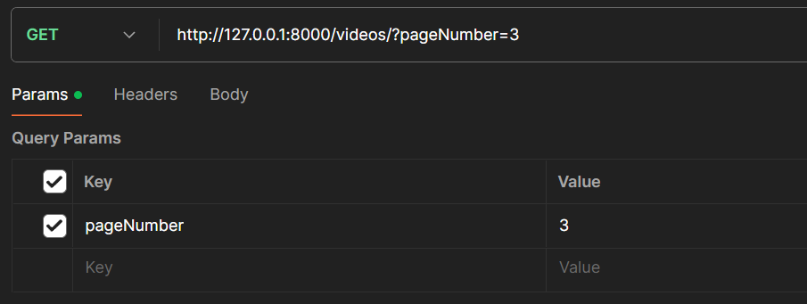
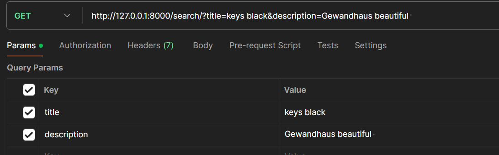

# GET Youtube API Videos

## To Run The Project Locally

### Method 1: Docker

1. Create an .env file.
2. Download the docker-compose.yml file from [here](https://github.com/adivis/GET_YT_VIDEOS/blob/main/docker-compose.yml).
3. Open the folder where you have stored this file in cmd and run `docker-compose up`.

### Method 2: Download or Clone

1. Download the code from repo or clone `git clone https://github.com/adivis/GET_YT_VIDEOS.git`
2. run `pip install virtualenv`(make sure python is installed).
3. go to the directory in the command prompt.
4. run `virtual venv`
5. run `venv\Scripts\activate`
6. run `cd src` to go to src folder.
7. run `pip install -r requirements.txt` to install the dependencies.
8. Create an .env file outside src folder with content as -

   ```
   DJANGO_SECRET_KEY = "django-insecure-55ri(iciad5vns97c@1iy2&gbqr!_xxm%8m&d^q888nom034r$"
   TIME_INTERVAL_BWT_CALLS = 10
   ```

9. **Run migrations** - Run `python manage.py makemigrations` and `python manage.py migrate`

10. **Run the server** - Open two terminal and run two commands separately `python manage.py runserver` and `python manage.py run_searching_in_bg.py`

## Description

- Once the server is started, the run_searching_in_bg.py will start searching from the youtube API in the background with a set interval provided in .env.
- Add an API key by going to base_url/admin. Enter the creds as username:user password:1234.
- **It is important to add API key to make the server work**.
- To veiw the video, use a GET request with url as - base_url/videos/ and provide a param name pageNumber with integer value to see a particular page. Response will give 10 videos with previous and next page number.
  
- To use search api, use a GET request with url as - base_url/search/ and and provide a param name title and description. Response will be partial match result.
  
- The dashboard to view the stored videos with filters and sorting options can be found in admin panel(base_url/admin). Go to videos and we can see the filter option based on published date, sorting based on published date and searching based on title and description.

## Funtionalities Of The Project

- Calling the YouTube API continuously in background with some interval for fetching the latest videos for a predefined search query.
- A GET API which returns the stored video data in a paginated response sorted in descending order of published datetime.
- A Optimise search api, to search the stored videos using their title and description.
- A dashboard to view the stored videos with filter, searching and sorting.
- Automatic updation of API key if quota is exhausted.
